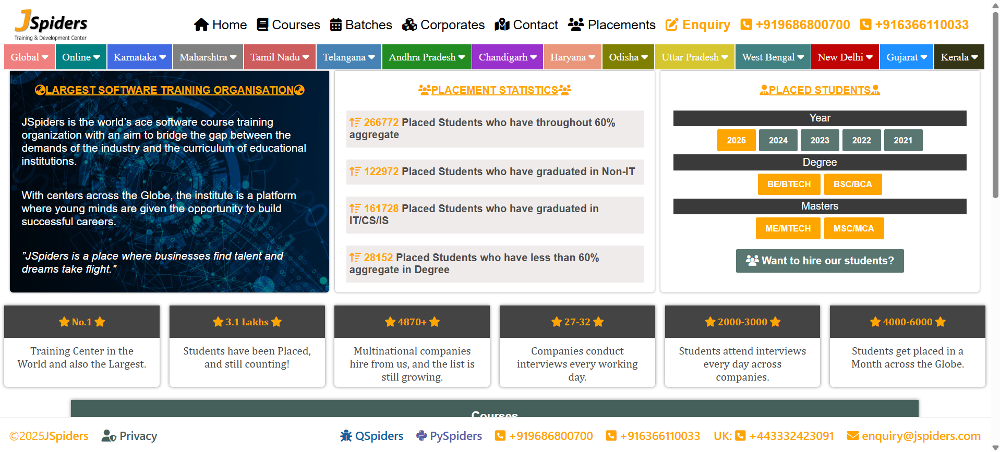

# 🕸️ JSpiders Homepage Clone (Static HTML & CSS)

This is a **static clone** of the homepage of the [JSpiders](https://jspiders.com) website. It is built using **only HTML and CSS**, with no JavaScript, and is **not responsive**.

## 📄 Features

- Pixel-approximate static design of the JSpiders homepage  
- Built using semantic HTML and custom CSS  
- Ideal for beginners learning web design or layout structuring  

## 📷 Preview

## 📁 Technologies Used

- HTML5  
- CSS3  

> No frameworks, libraries, or JavaScript were used.

## 🚀 How to View

1. Clone or download the repository.
2. Open `home.html` in any modern web browser.

## 🧠 Notes  

- This project is not responsive and is intended for desktop use.
- Built for learning purposes.
- No affiliation with JSpiders.

## 📬 Author  

Made with ❤️ by [Pritam Premi](https://github.com/pritampremi)
